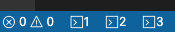
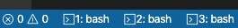

#  Extended Terminal Integration

Adds icons for each terminal process to the status bar.





### Please note:

This extension is currently still under development. Therefore, commands or configuration parameters may no longer exist or be renamed in the future.

The VS Code identifier of the extension has changed from version 0.2.0 to 0.3.0. The reason for that is the extension shouldn't only take care of the display of the open terminal processes in the status bar. Rather, it is intended to provide general tools and improvements relating to terminal integration in VS Code. An example of this is the possibility of startupTerminals. The current ID will definitely be retained in the future.

## Commands

| Command               | Description                                   |
| --------------------- | --------------------------------------------- |
| Create Terminal       | Create a new terminal.                        |
| Close All Terminals   | Close all existing terminal processes.        |
| Close Active Terminal | Closes the currently active terminal process. |

## Configuration

### Prefix: extendedTerminalIntegration

| Property                    | Typ                                        | Description                                                                                                                                                                                 |
| --------------------------- | ------------------------------------------ | ------------------------------------------------------------------------------------------------------------------------------------------------------------------------------------------- |
| maxTerminalIcons            | number                                     | Maximum number of icons displayed.                                                                                                                                                          |
| preferLatestTerminals       | boolean                                    | Prefer the latest terminals if the maximum number of displayed icons is exceeded.                                                                                                           |
| showTerminalIndex           | boolean                                    | Shows the terminal index next to the icon in the status bar.                                                                                                                                |
| showTerminalName            | boolean                                    | Shows the terminal name next to the icon in the status bar.                                                                                                                                 |
| startupTerminals            | [ { id: string, startupCommand?: string} ] | Defines a list of terminals to be opened when vscode is started. Each terminal must have an id, which is treated as a terminal name and, optionally, a command that is executed at startup. |
| refreshTerminalNameInterval | number                                     | Time in seconds until the terminal name is updated.                                                                                                                                         |

### Example

```
{
  "extendedTerminalIntegration.maxTerminalIcons": 3,
  "extendedTerminalIntegration.preferLatestTerminals": true,
  "extendedTerminalIntegration.showTerminalIndex": false
  "extendedTerminalIntegration.showTerminalName": false,
  "extendedTerminalIntegration.startupTerminals": [
    {
      "id": "devServer",
      "startupCommand": "npm run dev"
    }
  ],
  "extendedTerminalIntegration.refreshTerminalNameInterval": 2
}
```
